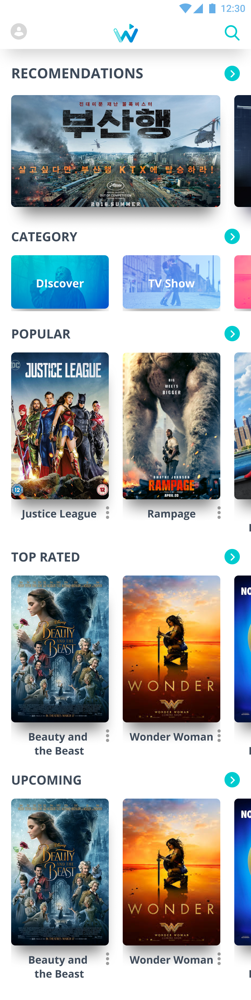
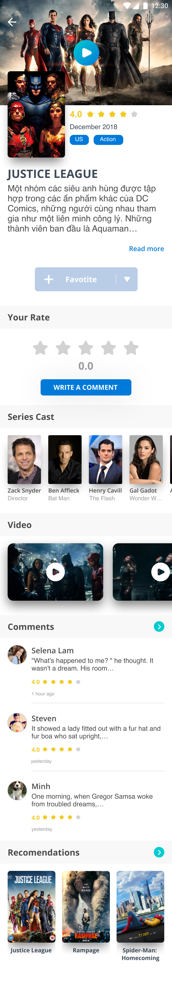

The Movie Database Example
===========================================================

Introduction
-------------
- This is a sample application that build with combine use Clean Architecture framework and Movie Database API (https://www.themoviedb.org/documentation/api) for request and showing the information
- This is an update from v1 sample with using Hilt and Coroutines replace for Dagger v2 and RxJava.

User interface
-------------
The UI will have two parts: Home screen and Movie detail screen as images below.

### Home screen

### Movie detail screen

How to build
-------------
* Check out project from link: https://github.com/hungan1409/TheMovieDatabase.git
* Use Android Framework from 3.5.x or greater for compile and run.

Framework
-------------
This example use Clean Architecture approach for build project.
(https://blog.cleancoder.com/uncle-bob/2012/08/13/the-clean-architecture.html)

### Data-Flow

### Work-Flow

Libraries
-------------
* [Foundation][0] - Components for core system capabilities, Kotlin extensions and support for
  multidex and automated testing.
  * [AppCompat][1] - Degrade gracefully on older versions of Android.
  * [Android KTX][2] - Write more concise, idiomatic Kotlin code.
  * [Test][4] - An Android testing framework for unit and runtime UI tests.
* [Architecture][10] - A collection of libraries that help you design robust, testable, and
  maintainable apps. Start with classes for managing your UI component lifecycle and handling data
  persistence.
  * [Data Binding][11] - Declaratively bind observable data to UI elements.
  * [Lifecycles][12] - Create a UI that automatically responds to lifecycle events.
  * [LiveData][13] - Build data objects that notify views when the underlying database changes.
  * [Navigation][14] - Handle everything needed for in-app navigation.
  * [Room][16] - Access your app's SQLite database with in-app objects and compile-time checks.
  * [ViewModel][17] - Store UI-related data that isn't destroyed on app rotations. Easily schedule
     asynchronous tasks for optimal execution.
  * [WorkManager][18] - Manage your Android background jobs.
* [UI][30] - Details on why and how to use UI Components in your apps - together or separate
  * [Animations & Transitions][31] - Move widgets and transition between screens.
  * [Fragment][34] - A basic unit of composable UI.
  * [Layout][35] - Lay out widgets using different algorithms.
* Third party
  * [Glide][90] for image loading
  * [Kotlin Coroutines][91] for managing background threads with simplified code and reducing needs for callbacks
  * [Hilt][93] for dependencies injection
  * [Retrofit][94] Type-safe HTTP client for Android
  * [EasyPermission][95]  is a wrapper library to simplify basic system permissions logic when targeting Android M or higher.
  * [CircleImageView][96]  a fast circular ImageView perfect for profile images.

[0]: https://developer.android.com/jetpack/components
[1]: https://developer.android.com/topic/libraries/support-library/packages#v7-appcompat
[2]: https://developer.android.com/kotlin/ktx
[4]: https://developer.android.com/training/testing/
[10]: https://developer.android.com/jetpack/arch/
[11]: https://developer.android.com/topic/libraries/data-binding/
[12]: https://developer.android.com/topic/libraries/architecture/lifecycle
[13]: https://developer.android.com/topic/libraries/architecture/livedata
[14]: https://developer.android.com/topic/libraries/architecture/navigation/
[16]: https://developer.android.com/topic/libraries/architecture/room
[17]: https://developer.android.com/topic/libraries/architecture/viewmodel
[18]: https://developer.android.com/topic/libraries/architecture/workmanager
[30]: https://developer.android.com/guide/topics/ui
[31]: https://developer.android.com/training/animation/
[34]: https://developer.android.com/guide/components/fragments
[35]: https://developer.android.com/guide/topics/ui/declaring-layout
[90]: https://bumptech.github.io/glide/
[91]: https://github.com/Kotlin/kotlinx.coroutines
[92]: https://github.com/ReactiveX
[93]: https://dagger.dev/hilt/
[94]: https://github.com/square/retrofit
[95]: https://github.com/googlesamples/easypermissions
[96]: https://github.com/hdodenhof/CircleImageView

License
--------

Copyright 2017 The Android Open Source Project, Inc.

Licensed to the Apache Software Foundation (ASF) under one or more contributor
license agreements.  See the NOTICE file distributed with this work for
additional information regarding copyright ownership.  The ASF licenses this
file to you under the Apache License, Version 2.0 (the "License"); you may not
use this file except in compliance with the License.  You may obtain a copy of
the License at

http://www.apache.org/licenses/LICENSE-2.0

Unless required by applicable law or agreed to in writing, software
distributed under the License is distributed on an "AS IS" BASIS, WITHOUT
WARRANTIES OR CONDITIONS OF ANY KIND, either express or implied.  See the
License for the specific language governing permissions and limitations under
the License.